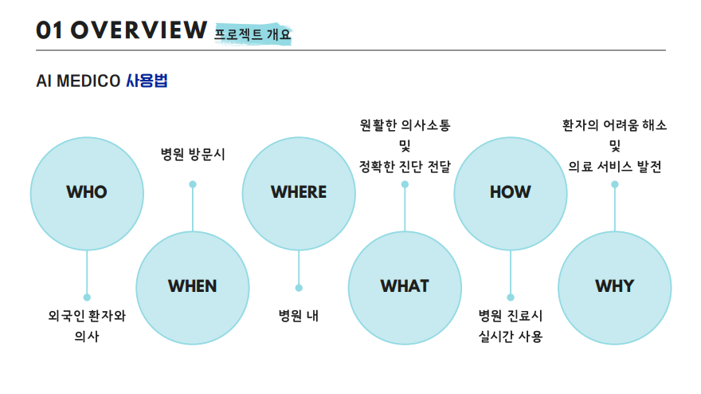
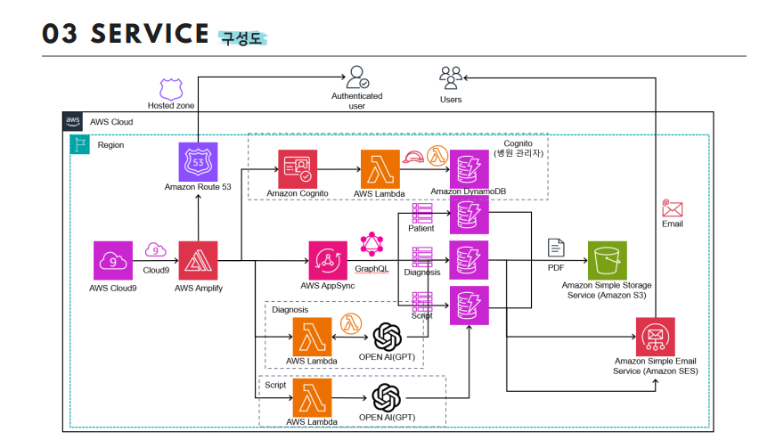
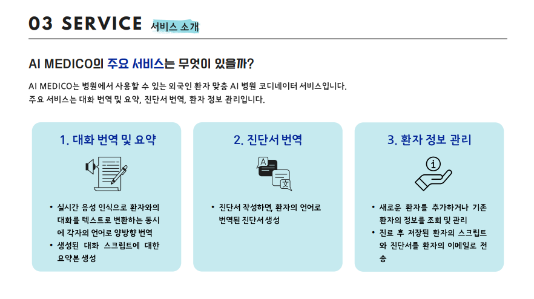

# AI-MEDICO

## 외국인 환자 맞춤 AI 병원 코디네이터 서비스
- 2023 데이터청년캠퍼스 팀 프로젝트
- 기간: ‘23년 7월 ~ ‘23년 08월(1개월)
- 수상: 데이터 청년 캠퍼스 우수상 & AWS 1위
- 기술 스택: React, OpenAI(GPT), AWS Cloud9, Lambda, DynamoDB, SES, graphql
- 주요 기능: 회원 관리 및 로그인, 실시간 양방향 대화 번역 및 요약, 진단서 번역, 이메일 전송
 

## 1️⃣ 개요

 

## 2️⃣ 배경 및 필요성
해외 체류 중이거나 여행 시 의료 서비스를 받기 꺼리는 환자들이 많이 있습니다. 가장 큰 이유로는 의사소통의 어려움이 있고, 그 외 우리나라와는 다른 병원 시스템과 비용 등의 문제를 꼽을 수 있습니다. 또한 자료에 따르면 국내 외국인 환자의 현황도 언어권별 코디네이터가 있는 서울과 수도권 병원에 압도적으로 몰려있는 것으로 나타났습니다. 이번 프로젝트에서는 병원에서 코디네이터 역할을 제공할 수 있는 서비스를 만들어서 해외 병원 방문 부담을 줄이고, 만족도를 향상시키는 것을 목표했습니다.

 

## 3️⃣기능 & 아키텍쳐

 

## 4️⃣과정

❶주제 선정 ❷웹 디자인 및 기능 구상 ❸아키텍쳐 설계 ❹웹 개발

### 👤역할
회원관리 페이지 개발 및 백엔드 DB 구축 & 프론트와 연결
 

### 🧐 Main Issues
- 팀원들 모두 AWS를 다뤄본 적이 없어서 전반적인 과정 내내 오랜 시간을 소모하였고, 계획보다 지연되는 상황이 여러 번 발생하였습니다.
- 아키텍쳐 설계 당시 사용하려고 했던 AWS comprehend medical, transcribe medical 등의 서비스가 서울 리전에 지원하지 않거나 한국어를 지원하지 않고, 음성 인식률이 낮은 등 여러 문제가 발생했습니다. 
- 프로젝트 마감 당일, 개발 마무리 단계에서 할당한 cpu자원을 초과하여 cloud9 개발 환경에 접근이 불가능해지며, 하루 동안의 작업량을 git으로 push할 수 없는 이슈가 발생했습니다.

### 🛠️ Resolved
- 팀원 전체가 매일같이 집에 간 후에도 각자 공부를 해오며 아침마다 공유를 했고, 마감일보다 일주일 정도의 여유 기간을 두고 타이트하게 진행했기 때문에 조금씩 지연되는 상황에서도 마감 전에 완성할 수 있었습니다.
- 사용할 수 없는 서비스에 대한 해결방안으로 리전간 피어링을 하거나 GPT를 연결하는 방향으로 아키텍쳐를 재구성하는 방안이 나왔는데, 음성 인식률의 차이와 번역 속도 등을 감안해 GPT를 연결하는 방법으로 해결했습니다.
- 문제 발견 즉시 팀원 모두를 환경에서 나오도록 했고, 긴급 화상 회의를 소집하여 Cloudwatch를 통해 cpu사용량을 모니터링하면서 해결방법을 검색했습니다. 그러다 시간이 지날수록 조금씩 cpu사용량 지표가 줄어드는 것을 확인할 수 있었고, 1시간 정도 기다린 후 위험 방지를 위해 대표로 한 명만 환경에 접속해서 git에 push하도록 했습니다. 마지막으로 push가 완료된 후에는 환경을 일시중지하고, 더 높은 사양의 cpu로 스케일 업해서 문제를 해결할 수 있었습니다.

 

### 🎯 Result
기간 내에 배포와 최종 발표까지 성공적으로 완료할 수 있었고, 팀원들과 노력한만큼 성과도 거둬서 만족스럽게 마무리한 프로젝트입니다.
 
### ⭐ Learnd Lessons
- AWS에서 제공하는 다양한 서비스들에 대해 공부할 수 있었던 시간이었습니다. 
- 처음으로 AWS를 다뤄보면서 클라우드 서비스를 활용한 웹 개발에 대해 많이 배울 수 있었습니다. 특히, 프로젝트를 진행하면서 여러 가지 크고 작은 문제들이 발생했는데 그 덕분에 문제가 발생했을때 당황하지 않고 해결할 수 있는 능력을 많이 기를 수 있었습니다.
- git을 통한 협업 과정도 처음으로 경험할 수 있었고, 자주 push하는 습관의 중요성을 깨달았습니다.

